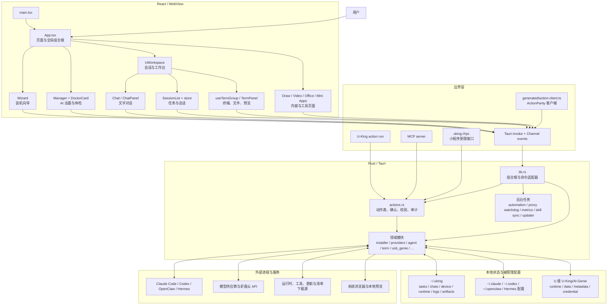
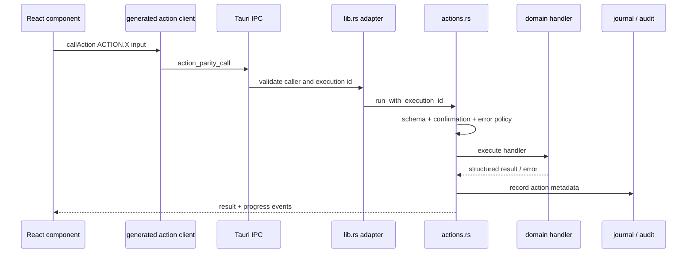
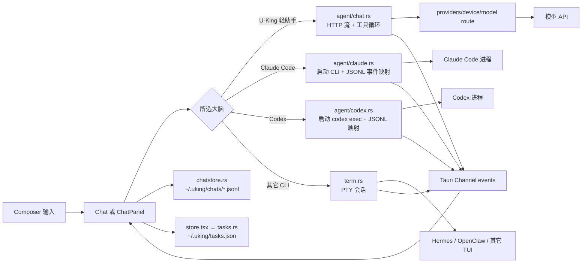
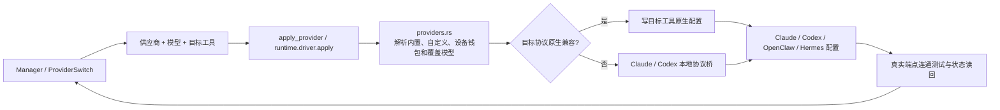

# U-King Architecture

> 基线：`4aefd2b`（2026-09-06）。本文描述当前代码，不代表需求榜中的功能已经发布。
> 生成本文时工作区已有 `src-tauri/Cargo.toml` 的未提交行尾差异；本文未修改业务代码。

## 一句话

U-King 是一个 Tauri 2 桌面应用：React 负责装机、配置和多 AI 工作台；Rust 负责系统探测、工具安装、
模型配置、PTY、AI 子进程、文件持久化及对外 Action API。U-King 自身没有集中式业务数据库，主要状态存成
用户目录下的 JSON / JSONL / YAML / TOML 文件，以及被管理 AI 工具各自的配置文件；少数兼容链路会读取或
修改 Hermes、uu-switch 等外部工具的 SQLite 数据库。

## 先看哪几个文件

接手项目时建议按这个顺序读：

1. [`src/main.tsx`](src/main.tsx) — WebView 前端入口。
2. [`src/App.tsx`](src/App.tsx) — 页面组合根、导航、首次启动和全局状态。
3. [`src/opencodex/UWorkspace.tsx`](src/opencodex/UWorkspace.tsx) — 当前唯一工作台外壳。
4. [`src-tauri/src/main.rs`](src-tauri/src/main.rs) — 原生进程入口，仅转入 `lib::run()`。
5. [`src-tauri/src/lib.rs`](src-tauri/src/lib.rs) — Tauri 组合根、启动后台任务、IPC 命令和适配器。
6. [`src-tauri/src/actions.rs`](src-tauri/src/actions.rs) — 无界面动作注册表、权限/确认元数据和统一执行入口。
7. [`action-parity.config.json`](action-parity.config.json) — Rust 动作表到前端生成物的关系。
8. [`src-tauri/src/providers.rs`](src-tauri/src/providers.rs) — 模型供应商解析、配置写入和连通验证。
9. [`src-tauri/src/installer.rs`](src-tauri/src/installer.rs) — 工具/运行时安装、下载、校验、升级。
10. [`src-tauri/src/agent/chat.rs`](src-tauri/src/agent/chat.rs) 与 [`src-tauri/src/term.rs`](src-tauri/src/term.rs) — 对话工具循环与 PTY。

若只改某个页面，先从 `App.tsx` 找挂载点，再顺着 `invoke(...)` 或生成的 `ACTION.*` 找 Rust 命令；
不要从 `lib.rs` 顶部开始顺序阅读一万行。

## 系统地图

## 入口与生命周期

### 前端入口

`index.html` 加载 `src/main.tsx`，后者创建 React 根并挂载 `App`。`App.tsx` 是前端组合根，主要负责：

- 获取本机环境、设备钱包、工具列表、更新状态和实例角色；
- 决定首次进入装机向导、我的 AI 或 U-Workspace；
- 挂载侧栏、标题栏、全局确认框、错误边界和 toast；
- 让 U-Workspace 常驻，仅用 `display` 切换，避免切页杀掉 PTY、对话和预览状态；
- 把安装、配置、卸载、充值及页面跳转连接到各功能组件。

主要用户路径：

| 用户目标 | 前端入口 | 后端主模块 |
| --- | --- | --- |
| 体检并安装 AI 工具 | `Wizard.tsx`、`App.tsx` | `installer.rs`、`tools.rs`、`toolprobe.rs` |
| 选择供应商和模型 | `Manager.tsx`、`ProviderSwitch.tsx` | `providers.rs`、`device.rs`、协议桥模块 |
| 文字对话 | `UWorkspace.tsx` → `Chat.tsx` / `ChatPanel.tsx` | `agent/chat.rs`、`agent/claude.rs`、`agent/codex.rs` |
| 应用内终端 | `ToolAppView.tsx`、`useTermGroup.ts` | `term.rs` |
| 制作 U 盘 AI 精灵 | `UsbToolDisk.tsx` | `actions.rs` → `usb_genie.rs` |
| 本地/云端内容生成 | `Create.tsx`、`Draw.tsx`、`Video.tsx` 等 | `image.rs`、`video.rs`、`reel.rs`、`artifacts.rs` |
| 本地模型 | `LocalLLM.tsx` | `localllm.rs` |
| 自动任务和活动记录 | `AutomationPanel.tsx`、`NightShift.tsx` | `automation.rs`、`journal.rs`、`metrics.rs` |

### 原生入口

`src-tauri/src/main.rs` 只调用 `u_king_mini_lib::run()`。`lib.rs::run()` 随后：

1. 处理命令行 / sidecar / 自检等无界面入口；
2. 构造 Tauri，加载单实例、opener、shell、dialog 等插件；
3. 在 `setup` 中恢复窗口、托盘、实例角色和服务回调；
4. 主实例启动自动任务调度、Codex 代理看门狗、用量汇总、内置小程序落地、技能包同步和更新暂存；
5. 注册 Tauri `invoke_handler`；
6. 退出时清理 PTY 和崩溃会话标记。

小程序 WebView 被禁止直接调用宿主 Tauri 命令，只能走 `uking://rpc` 的受限权限表。这道门位于
`invoke_handler` 外层，是当前小程序隔离的关键边界。

## API 与动作模型

项目存在两类本地 API：

### 1. 稳定动作 API

`actions.rs` 中的 `ActionSpec` 描述动作 ID、风险、确认要求、输入 schema、错误分类和处理器。
同一动作可以被 GUI、命令行 `action run`、MCP 和 U-Chat 的 `uking_action` 工具调用。

`scripts/generate-action-parity.mjs` 从 `actions.rs` 与 `lib.rs` 导出：

- `src/generated/action-parity.json`
- `src/generated/action-client.ts`

这两个文件是生成物，不应手改。

### 2. 传统 Tauri 命令

大量旧页面仍直接 `invoke("command_name")`，由 `lib.rs` 中的 `#[tauri::command]` 处理；部分命令内部再转调 Action，
部分直接调用领域模块。它们是兼容面，不等同于动作注册表。

当前静态计数用于理解规模，不作为测试结论：

- `lib.rs` 约 10,833 行，注册约 187 个 Tauri command；
- 前端约 351 个字符串形式的 `invoke(...)` 调用点；
- 生成客户端约 101 个 Action 常量，前端直接使用 `ACTION.*` 的位置约 27 个。

新增有业务意义的写操作，应先进入 `actions.rs`，再由 GUI/CLI/MCP 共用；纯界面动作无需 Action ID。

## 关键数据流

### 文字对话

U-King 轻助手的工具调用可读写工作目录、执行命令、生成媒体或调用 Action。写文件、编辑文件、执行命令和
有风险 Action 的批准在 `agent/chat.rs` 处理；无人值守状态不会自动执行写 Action。

### 模型供应商配置

这里的“供应商”是共享实体，“给某个 AI 使用”是每工具分配。`device.rs` 管设备钱包状态，
`model_route.rs` 只在解析器与运行时之间传递带密钥的路由，刻意不实现可打印序列化。

### 工具安装

`Wizard` 或工具页发起安装后，`installer.rs` 读取内嵌 `install-windows.json`，并可采用通过版本与内容检查的
远端清单；随后准备便携 Node/Python/Git、下载包、校验、安装、运行 `verify_cmd`，失败时执行清单中的修复步骤。
进度通过 Tauri 事件回到 UI。`tools.rs::TOOL_SPECS` 是工具目录真相源，探测与启动动作围绕它生成。

### U 盘 AI 精灵

`UsbToolDisk.tsx` 使用生成的 Action 客户端调用 `runtime.usb_genie.*`。`usb_genie.rs` 负责可移动盘身份、
文件系统/空间预检、固定 PicoClaw 包下载与校验、stage 后原子提交、相对路径配置、可选随盘凭据、verify、
launch 和凭据移除。它只管理 `U-King/AI-Genie` 范围，不应扫描或改写盘上其它文件。

## 模块分区

| 分区 | 主要文件 | 职责 |
| --- | --- | --- |
| 应用组合 | `App.tsx`、`lib.rs` | 页面/服务装配、生命周期和兼容入口 |
| 动作协议 | `actions.rs`、`generated/*`、`mcp*.rs` | 稳定动作、确认、输入校验、CLI/MCP/GUI 一致性 |
| 装机与工具 | `installer.rs`、`tools.rs`、`toolprobe.rs`、`cleanup.rs`、`skillpack.rs` | 下载、校验、安装、探测、启动、卸载和技能同步 |
| 模型与凭据 | `providers.rs`、`device.rs`、`model_route.rs`、`*_proxy.rs`、`freerouter.rs` | 供应商目录、钱包/BYOK、配置写入、协议转换和免费路由 |
| 工作台 | `UWorkspace.tsx`、`Chat.tsx`、`ChatPanel.tsx`、`store.tsx`、`tasks.rs`、`chatstore.rs` | 任务、会话、对话、历史和工作目录 |
| 终端与代理 | `term.rs`、`agent/*` | PTY、CLI 子进程、流式事件、超时/中断和权限询问 |
| 便携运行时 | `usb_genie.rs`、`openclaw2.rs`、`clawx.rs` | U 盘及便携 AI 的生命周期与状态边界 |
| 内容能力 | `image.rs`、`video.rs`、`reel.rs`、`vision.rs`、`draw.rs`、`officedoc.rs` | 图片、视频、视觉和办公产物 |
| 本地数据 | `usage_local.rs`、`metrics.rs`、`journal.rs`、`artifacts.rs`、`backup.rs` | 本地用量、行为记录、产物索引和备份 |
| 小程序 | `miniapp.rs`、`bundled_apps.rs`、`src-tauri/apps/*` | 小程序安装、权限清单、RPC 和内置 Web 应用 |

## 数据存储

U-King 自身没有集中式业务数据库或 SQL ORM。主要持久化边界如下：

| 路径/介质 | 内容 | 所有者 |
| --- | --- | --- |
| `~/.uking/tasks.json` | 工作台任务、文件夹、状态、来源 | `tasks.rs` |
| `~/.uking/chats/*.jsonl` | U-Chat 会话消息 | `chatstore.rs` |
| `~/.uking/chats/archived/` | 已归档会话与 manifest | `chatstore.rs` |
| `~/.uking/device.json` | 设备钱包及 pending 换 Key 状态 | `device.rs` |
| `~/.uking/runtime/`、`cache/`、`shims/` | 便携运行时、下载缓存、命令入口 | `installer.rs` |
| `~/.uking/skills/` 与各 AI 的 skills 目录 | U-King 技能包导出/同步 | `skillpack.rs` |
| `~/.uking/artifacts/` | 生成产物和索引 | `artifacts.rs` |
| `~/.uking/journal/`、用量/指标文件 | 本地活动记录与统计 | `journal.rs`、`usage_local.rs`、`metrics.rs` |
| `.claude`、`.codex`、`.openclaw`、Hermes 配置 | 被管理工具的供应商、模型和凭据引用 | `providers.rs` |
| 外部 SQLite（Hermes、uu-switch 等） | 本地用量读取、供应商导入与兼容写入；不是 U-King 的主状态库 | `usage_local.rs`、`uuswitch.rs` |
| U 盘 `U-King/AI-Genie/` | runtime、data、启动器、metadata、可选凭据 | `usb_genie.rs` |
| 浏览器 `localStorage` | 少量纯 UI 偏好和旧会话迁移兼容 | 各 React 组件 |

任务元数据与聊天正文是两份文件，前端 `store.tsx` 和 `chatstore.rs` 共同维持关联。聊天全量替换、归档清单、
设备钱包和 U 盘关键文件采用临时文件 + rename；修改这些流程时必须同时覆盖崩溃中断和并发写入。

## 最容易出问题的两个位置

### 1. `src-tauri/src/lib.rs`：组合根已经承担过多运行时职责

证据：约 10,833 行、187 个 Tauri command；同一个文件同时负责命令适配、动作 handler 注入、CLI 分流、
窗口/托盘、单实例、小程序 IPC 门禁、自动任务、代理看门狗、指标汇总、技能同步和静默更新。

为什么危险：

- 新增一个命令容易绕过 Action 的输入/确认/审计规则；
- 启动阶段任一后台任务的阻塞、重复启动或副作用，都可能表现为“应用启动慢/重复花钱/配置被覆盖”；
- 小程序 IPC 门禁与巨大 `generate_handler!` 清单相邻，重构时漏包裹会扩大宿主权限；
- GUI、CLI、MCP 与兼容命令在这里汇合，局部改动的爆炸半径难判断。

改这里前先做：确认改动属于组合还是业务；业务进入领域模块/Action handler；组合根只接线。对启动任务验证
“只起一次、有限时、失败不拦首屏、sidecar 不重复”。对新写操作检查 GUI、CLI、MCP 是否走同一确认规则。

### 2. `src-tauri/src/providers.rs`：一个模块写多个外部工具的真实配置

证据：约 10,055 行；它同时保存供应商、解析密钥、选择协议、写 Claude/Codex/OpenClaw/Hermes 等配置、
启停本地桥、迁移旧配置并执行真实连通测试。前端还有大量传统字符串 `invoke` 调用，动作生成客户端尚未覆盖全部调用面。

为什么危险：

- 各工具配置 schema、认证方式和进程缓存行为不同，一个“统一应用”改动可能只对部分工具真正生效；
- 密钥可来自设备钱包、已保存 BYOK、环境变量或请求覆盖，错误回显/日志很容易泄漏或选错来源；
- Claude/Codex 既可能原生直连，也可能经本地协议桥，状态读回若只看文件会把“写成功”误报成“可用”；
- 前端直调旧命令与 Action 路径并存，新增字段可能只接通其中一条。

改这里前先做：建立“供应商 × 工具 × 协议 × 密钥来源”测试矩阵；所有写入先备份、结构化 merge、原子替换、
再由目标工具或真实端点读回。新增入口优先复用 Action；不得仅用 UI toast 或配置文件存在证明成功。

## 维护边界

- `src/generated/*` 是生成物，只改 Rust 动作表和生成脚本。
- `tools.rs::TOOL_SPECS` 是工具目录真相源，不在页面另建工具列表。
- `UWorkspace` 是当前工作台外壳；旧 OpenCodex 外壳已删除，不要从历史代码恢复第二套状态。
- 浏览器面板已收敛为预览 + 系统浏览器打开；后端机器调用能力与 UI 面板不是同一层。
- 需求状态只维护在 `docs/需求榜.md`；架构文档只解释现状，不承载第二份待办。
- 发布前按仓库 `AGENTS.md` 运行泄漏检查、Rust 测试和前端构建；只写本文无需宣称产品已通过发布闸门。
